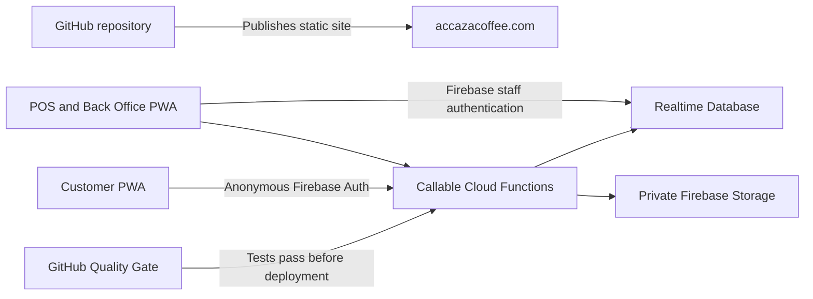

# Accaza Coffee House — Authoritative Project Handoff

**Prepared:** 10 August 2026  
**Release candidate:** Release 7H  
**Local builds:** admin v174, customer v45, service-worker cache v71  
**Truth source:** current workspace plus `release-manifest.json`

## Deployment truth

The current source and complete CI-equivalent suite are validated locally. Danilo confirmed releases through 5D were deployed and production-tested, and confirmed the GitHub Quality Gate passed during Release 6B troubleshooting. Later releases including this 7H package must not be described as production-verified until the corresponding fields in `release-manifest.json` are changed from `pending` using real evidence.

Do not infer production status from a build number in a local file. Confirm the live site, Firebase deployment output, System Health data, and smoke-test record.

## System at a glance

- Static website/PWA: GitHub repository `dmmagbual/accaza-sartoga`; production domain `https://accazacoffee.com`.
- Firebase project: `accaza-sartoga`.
- Realtime Database: `asia-southeast1` URL configured in the frontend.
- Cloud Functions: Node.js 22, region `asia-southeast1`.
- Storage: private default bucket; payment proofs are retrieved through an authorized Function, not public URLs.
- Authentication: Firebase email/password for portal users and Anonymous Auth for customers.
- PWA: separate customer and POS manifests; one service worker with coordinated cache v71.
- Currency: Philippine peso (PHP/₱) in the current Accaza application.

## Authoritative file map

| Responsibility | Authoritative files |
|---|---|
| Customer application | `index.html`, `assets/js/customer/`, `manifest.json` |
| POS/back office shell | `admin.html`, `assets/js/admin/`, `manifest-admin.json` |
| Shared costing authority | `assets/js/shared/costing.js`, byte-identical `functions/lib/costing.js` |
| Cloud Functions | `functions/index.js`, `functions/lib/financial.js`, `functions/lib/offline-sync.js`, `functions/lib/order-status.js` |
| Firebase deployment | `firebase.json`, `database.rules.json`, `storage.rules` |
| PWA cache | `sw.js`, favicon PNG/ICO files, `assets/js/pwa-register.js` |
| Automated controls | `tests/`, `.github/workflows/`, root and Functions package files |
| Release truth | `release-manifest.json`, this file, release ADRs/runbooks |

Never edit or deploy `admin-backup.html`, `index backup*.html`, `index-pos.html`, `Firebase rules - backup.txt`, database exports, ZIP archives, spreadsheets, `PRICING and COSTING/`, `pictures/`, or `video animation/`. These are local references or retired copies and are excluded by `.gitignore`.

## Runtime architecture

The application intentionally remains a lightweight native HTML/JavaScript Firebase PWA rather than a framework rewrite. `admin.html` loads a small shared core and the lightweight Overview command center, then lazy-loads POS, register, inventory, recipes, analytics, finance, staff access, channel pricing, packages, and System Health modules only when needed.

`/orders` is authoritative. `/activeOrders` is a bounded projection for live screens. Closed/resolved orders leave the active projection while authoritative history remains available through bounded/paginated reads.

The browser previews prices and COGS. Cloud Functions are authoritative for customer pricing, portal order-status transitions, inventory movements, COGS snapshots, financial movements, sensitive approvals, payout settlement, archive decisions, and offline sale replay. Existing order status can no longer be changed directly by a browser; `updateOrderStatus` records the actor, transition history, idempotency claim, and operational audit.

## Authentication and roles

`/admins/{firebaseUid}` defines the real portal role. Supported server roles are owner, superadmin, admin, manager, cashier, kitchen, finance, and staff. The login-page selector is visual only and cannot grant authority.

- Owner/superadmin/admin/manager use the admin UI branch.
- Cashier/kitchen/finance/staff use the staff UI branch and `adminPerms` tab permissions.
- Sensitive Functions independently verify the Firebase identity and required role/approval.
- POS PINs are convenience controls, not trusted financial authorization.
- Customer ownership uses Firebase UID; customers cannot read another customer's owned order/profile.

## Firebase data ownership

Key nodes and authority boundaries:

| Node/group | Purpose | Write authority |
|---|---|---|
| `menuItems`, `categories`, `optionGroups`, `availability` | Public catalog and availability | Authorized portal roles under rules |
| `orders` | Authoritative order records | Status through server commands; other controlled portal updates; customer creation/confirmation through Functions |
| `activeOrders` | Bounded live projection | Status through server projection/commands; other authorized POS updates |
| `customerOrders`, `appCustomers` | UID-keyed customer index/profile | Owner-scoped constrained updates and server logic |
| `orderLocks` | Duplicate-order protection | Server only/private |
| `inventory`, `inventoryBalances`, `inventoryMovements` | Item master, current balance, immutable movement history | Quantity/cost and movements are server-authoritative |
| `recipes`, `optionRecipes` | Base/consumable and optional costing definitions | Validated portal workflow plus server normalization |
| `financialMovements` | Immutable balanced accounting evidence | Server only |
| `cfLedger`, `receivables`, `payables`, `platformPayouts` | Financial projections and settlement | Server-controlled posting/settlement |
| `financialApprovals`, `cashCustody`, `chartOfAccounts` | Manager approvals, register custody, controlled accounts | Sensitive server workflows |
| `shifts`, `posActiveShift` | Register opening, tender, close and reconciliation | Authorized POS/register workflow plus server triggers |
| `offlinePosSync` | Exactly-once offline replay claims/evidence | Server only/private |
| `archivedOrders`, `operationalAudit`, `deletionAudit` | Retention and immutable control evidence | Server only |
| `clientTelemetryDaily` | Privacy-safe daily aggregate timing/errors | Function writes; owner/admin/manager read |

Database indexes and exact expressions live only in `database.rules.json`; do not copy rules from this summary. Default root access is denied.

## Critical financial and inventory behavior

- Each inventory movement has a stable idempotency key. Retries must not double-deduct or double-return stock.
- Inventory quantity and weighted-average cost are movement-controlled. Browser editing of protected quantity/cost/unit fields is denied.
- Browser and server costing engines must remain byte-identical; CI checks this.
- Finalized orders receive authoritative usage, `cogsSnapshot`, and detailed cost-source evidence.
- Financial movements are balanced, immutable, source-linked, and retry-safe.
- In-store sales post actual tender assets; split payments preserve each tender.
- GrabFood/FoodPanda revenue is gross, commission is expense, and expected net remains receivable until payout settlement.
- Payout reconciliation settles only matched orders; prefix-tolerant matching does not waive amount/duplicate controls.
- Refunds/voids post linked reversals and inventory returns according to server rules.
- Closed-shift cash moves into custody, then to a later float or bank deposit with traceable movements.

## Offline behavior

Only eligible cash POS sales use the durable offline path. A client transaction ID is assigned before IndexedDB queueing. UI states are Pending, Syncing, Failed, and Synced. A sale is never called synchronized until the callable confirms it. `syncOfflinePosSale` uses server-side idempotency and applies denomination drawer deltas exactly once.

## Performance architecture and targets

- POS-critical listeners start only after successful authorization.
- Heavy analytics, finance, recipes, and history listeners are lazy/bounded.
- Active order cards update incrementally where possible.
- Payment proof images are private and loaded only on request.
- System Health reads exactly 7 or 30 date-keyed aggregate records and is lazy-loaded.

Targets:

- Warm POS launch under 1.5 seconds.
- Cold launch under 3 seconds.
- Cart response under 100 ms.
- Remote order arrival within 1.5 seconds target.
- Initial active-order payload under 250 KB excluding proofs.
- No lifetime-history read during startup.

System Health currently reports arithmetic average and worst observation, not p95. Never relabel those values as percentiles.

## Cloud Functions

The exact export list is machine-checked from `release-manifest.json`. Major groups are:

- Customer ordering/proofs: `createOnlineOrder`, `confirmOrderReceived`, `getPaymentProof`, `notifyOnComplete`.
- Order operations: `updateOrderStatus` with stale-state, transition, idempotency, projection, and audit controls.
- Active data: `ensureActiveOrders`, `syncActiveOrderProjection`, `pruneClosedShiftOrders`.
- Inventory/costing: `validateRecipeDefinition`, `postInventoryMovements`, `ensureInventoryLedger`, `onOrderFinalize`, `onOrderInventoryReversal`.
- Finance: order/shift/petty triggers plus financial command, payout, adjustment, backfill, chart, and audit callables.
- Controls/retention: approvals, archive, discrepancy, petty decision, and activity retention callables.
- Reliability/monitoring: `syncOfflinePosSale`, `recordClientTelemetry`.

## Deployment procedure

1. Run `npm run test:ci` at the project root.
2. Export/verify a current Firebase backup for any rules, Functions, inventory, or finance change.
3. Publish the exact coordinated GitHub file set from the applicable release document.
4. Deploy only changed Firebase targets:

   - Rules: `firebase deploy --only database,storage`
   - One Function: `firebase deploy --only functions:functionName`
   - All Functions: `firebase deploy --only functions`

5. Hard refresh or accept the PWA update, confirm visible build/cache behavior, and run the release smoke test.
6. Record the Git commit, Firebase result, tester, time, and rollback decision in the release evidence.

Do not upload `node_modules`. Functions deployment requires `functions/package.json`, `functions/package-lock.json`, `functions/index.js`, and `functions/lib/` in GitHub/local deployment source.

## Production verification

The release is not fully verified until every pending field in `release-manifest.json` has evidence:

1. v173 production smoke test passes on the cashier device.
2. System Health contains enough live samples to assess launch, cart, Charge, sync, and remote arrival.
3. A Firebase backup is restored into a separate test project and representative financial/inventory records are verified.
4. Role tests cover owner, manager, cashier, kitchen, and finance.
5. Dependencies are reviewed without combining a major upgrade with business behavior changes.

Use `OPERATIONS_RELEASE_RUNBOOK.md`. Change the manifest to `production_verified` only after all verification values are no longer `pending`.

## Known limitations

- Production timing evidence for v173 is pending; local tests cannot prove real cashier-device speed.
- The telemetry schema does not retain individual samples, device segmentation, or percentiles.
- App Check enforcement remains intentionally cautious until production token monitoring is consistently clean; do not enable database-wide enforcement without admin initialization and testing.
- Some legacy authorized browser writes remain for ordinary operational nodes; protected inventory/financial authority is server-side, but future hardening can move more commands behind Functions.
- The source still contains large native JavaScript modules, especially POS/register/analytics. They are lazy-loaded, but further splitting should be driven by measured regressions, not cosmetic architecture goals.
- The workspace contains sensitive/private backup and business files. `.gitignore` protects them only if Git operations honor it; never use broad manual upload.
- GitHub static hosting and Firebase are separate deployments; a green frontend workflow does not prove Firebase rules/Functions are current.

## Validation and recovery

- Full gate: `npm run test:ci`.
- Release consistency only: `npm run test:release`.
- Firebase rules only: `npm run test:rules`.
- Repository safety only: `npm run test:safety` (fully enforced in an actual Git checkout/CI).
- Rollback must restore coordinated HTML, modules, service worker, Functions, and rules appropriate to the release. Never roll back only one tightly coupled file.

## Continuation rules for Claude

1. Read `CLAUDE.md`, this handoff, `release-manifest.json`, and the latest relevant ADR/release note.
2. Inspect the actual files before editing and preserve user changes.
3. Discuss major features first; implement accepted changes in small coordinated releases.
4. Prefer server authority, bounded reads, idempotency, and traceability over convenience.
5. Every financial number must identify its source document/movement.
6. Give Danilo exact GitHub and Firebase file/command lists after each build.
7. Update this handoff and manifest only when the underlying source or verified deployment truth changes.
