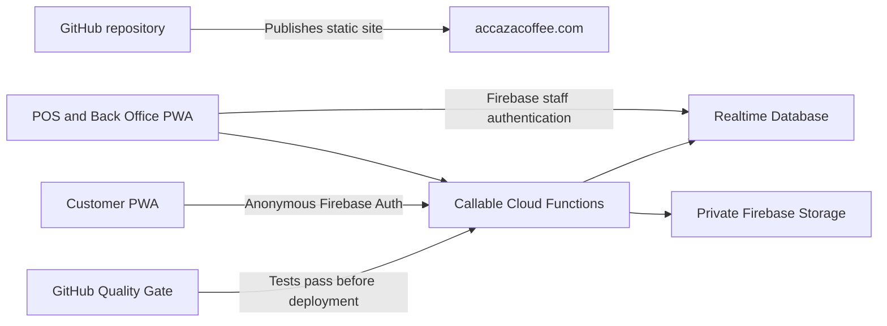

# Accaza Coffee House — Authoritative Project Handoff

**Prepared:** 10 August 2026 (Release 7H); header refreshed 28 September 2026  
**Current builds:** read `release-manifest.json` → `builds` (28 Sep 2026: admin v612, Finance Books v134, customer v85, service-worker cache v597). Build numbers in older sections of this file are historical.  
**Truth source:** current workspace plus `release-manifest.json`  
**Pending production evidence:** see `docs/PRODUCTION_EVIDENCE_CHECKLIST.md`

## Deployment truth

The current source and complete CI-equivalent suite are validated locally. Danilo confirmed releases through 5D were deployed and production-tested, and confirmed the GitHub Quality Gate passed during Release 6B troubleshooting. Later releases including this 7H package must not be described as production-verified until the corresponding fields in `release-manifest.json` are changed from `pending` using real evidence.

Do not infer production status from a build number in a local file. Confirm the live site, Firebase deployment output, System Health data, and smoke-test record.

## System at a glance

```mermaid
flowchart LR
  C[Customer PWA] -->|Anonymous Firebase Auth| F[Callable Cloud Functions]
  P[POS and Back Office PWA] -->|Firebase staff authentication| D[Realtime Database]
  P --> F
  F --> D
  F --> S[Private Firebase Storage]
  G[GitHub repository] -->|Publishes static site| W[accazacoffee.com]
  Q[GitHub Quality Gate] -->|Tests pass before deployment| F
```

- Static website/PWA: GitHub repository `dmmagbual/accaza-sartoga`; production domain `https://accazacoffee.com`.
- Firebase project: `accaza-sartoga`.
- Realtime Database: `asia-southeast1` URL configured in the frontend.
- Cloud Functions: Node.js 22, region `asia-southeast1`.
- Storage: private default bucket; payment proofs are retrieved through an authorized Function, not public URLs.
- Authentication: Firebase email/password for portal users and Anonymous Auth for customers.
- PWA: separate customer and POS manifests; one service worker with coordinated cache v77.
- Currency: Philippine peso (PHP/₱) in the current Accaza application.

## Authoritative file map

| Responsibility | Authoritative files |
|---|---|
| Customer application | `index.html`, `assets/js/customer/`, `manifest.json` |
| POS/back office shell | `admin.html`, `assets/js/admin/`, `manifest-admin.json` |
| Shared costing authority | `assets/js/shared/costing.js`, byte-identical `functions/lib/costing.js` |
| Cloud Functions | `functions/index.js`, `functions/lib/financial.js`, `functions/lib/offline-sync.js`, `functions/lib/order-status.js` |
| Firebase deployment | `firebase.json`, `database.rules.json`, `storage.rules` |
| PWA cache | `sw.js`, favicon PNG/ICO files, `assets/js/pwa-register.js` |
| Automated controls | `tests/`, `.github/workflows/`, root and Functions package files |
| Release truth | `release-manifest.json`, this file, release ADRs/runbooks |

Never edit or deploy `admin-backup.html`, `index backup*.html`, `index-pos.html`, `Firebase rules - backup.txt`, database exports, ZIP archives, spreadsheets, `PRICING and COSTING/`, `pictures/`, or `video animation/`. These are local references or retired copies and are excluded by `.gitignore`.

## Runtime architecture

The application intentionally remains a lightweight native HTML/JavaScript Firebase PWA rather than a framework rewrite. `admin.html` loads a small shared core and the lightweight Overview command center, then lazy-loads POS, register, inventory, recipes, analytics, finance, staff access, channel pricing, packages, and System Health modules only when needed.

`/orders` is authoritative. `/activeOrders` is a bounded projection for live screens. Closed/resolved orders leave the active projection while authoritative history remains available through bounded/paginated reads.

Serving queue (admin 618, 29 Sep 2026): every POS sale the server accepts (`syncOfflinePosSale`) is stamped `service.state: queued` and appears in the queue immediately after Charge & Complete. Each row has a blue PREPARE action; it opens a centered order-detail card with SERVED (PICKED UP NOW for GrabFood/FoodPanda) and BACK TO QUEUE. Staff clear it through `manageOrderService`, or record it as not collected (manager review). The Shift Orders badge counts every order assigned to the open shift, including served orders; the separate Serving Queue shows only orders still waiting. Queued and unreviewed not-collected orders stay in `/orders` and `/activeOrders` across shift close (`OrderService.keepsOrderLive` in `shouldProjectOrder`). Shift close asks for an outcome for every unserved order before the cash count and prints it on the Z report; it never blocks the close. Serving state is operational only: no revenue, tender, inventory, COGS or Finance Books effect. Website orders complete through `updateOrderStatus`. Logic: `functions/lib/order-service.js`, `src/admin/pos/50a-register-shell.js`, `src/admin/pos/51-serve-queue.js`; tests `tests/serving-queue-check.mjs` and `tests/serving-queue-runtime-check.mjs` (executes the built POS bundle). Every POS section must sit inside the bundle IIFE, which closes at the end of the last section.

Runtime bundle sections (admin 616, 29 Sep 2026): `tools/build-runtime-bundles.mjs` joins `src/admin/<bundle>/*.js` in file-name order. The POS closure now closes in its own last section, `src/admin/pos/99-module-close.js` (the 616 hotfix first moved it to the end of `51-serve-queue.js`); build 615 put `51-serve-queue.js` after the old closing line, so the POS tab failed with "This section could not load" (`onlineOrdersMap is not defined`). `tests/bundle-closure-check.mjs` fails the build if any closure bundle closes early or leaks a section function to the global scope. New POS sections must sort before `99-`.

Firebase load guards and bundle split (admin 646, customer 96, SW 635, 6 Oct 2026):
- Accaza AI record tools (`src/functions/62a-accaza-ai-records.js`) meter every Realtime Database read by its JSON size. One question stops at 8 MB and all questions stop at 50 MB per Manila day (`aiAnalyticsUsage/{day}.rtdbBytes`). Each tool reserves its maximum row count before it reads, so parallel calls cannot overshoot the 2,500-record budget. `get_sales` reads archived sales from the Firestore replica (salesAt, under the 3,000-read AI allowance) once `systemHealth/historicalArchive/salesAtReady` is true.
- `createQrOrderTicket`, `manageQrOrderTicket` and `createOnlineOrder` rate-limit first and read only `/posActiveShift/id` and `/status` (`readActiveShiftHead`), never the whole growing shift record.
- Backup tracks `loyaltyLedger`, `loyaltyRewards`, `dragonQuestLedger`, `dragonQuestOrderIndex` and `archivedQrTickets` incrementally (the first run after deploy is a full backup). `qrOrderLocks`, `loyaltyOtp` and `loyaltyLinkThrottle` are excluded from backups. `pruneEphemeralNodes` clears expired OTPs, SMS throttles, QR locks, QR queue counters (7 days), AI guest usage and provider health (30 days) and daily stamp counters (3 days).
- Bundle budgets: the Order Archive panel moved to `assets/js/admin/order-archive-panel.mjs` and 109 double-encoded characters in `core.mjs` were repaired. The Daily Report print and Excel export moved to `assets/js/admin/daily-report-output.mjs`, and the customer help chat to `assets/js/customer/chatbot.mjs`. No ceiling was raised.

Dead POS code removed (admin 647, SW 636, 6 Oct 2026): the Recipes screens retired on 6 Sep (Share choices/option library, Repair & restore incl. the duplicated-COGS correction, Optional ingredients, Consumables) and the Receive Stock and brand-breakdown dialogs had no caller left. Their code is deleted (`pos.js` 584,513 -> 527,670 bytes) and admin no longer downloads `recipe-temperature-plan.js`, `cogs-duplication-audit.js` or `option-library-plan.js`. The planners stay for offline use (`tools/recipe-temperature-repair.mjs`, `tools/option-library.mjs`). Danilo confirmed the early-Sep COGS correction was posted. Restore any screen from git history (before PR for admin 647) if it is ever needed again.

POS start-up and AI providers (admin 648, SW 637, 6 Oct 2026): `admin.html` keeps the customer-site sections hidden by `portal.css`, but their hero and 9 gallery photos (16.6 MB from postimg.cc) had no `loading="lazy"`, so every POS/admin load downloaded them and the load event waited (POS launch averaged 11-17 s against a 3 s target). They and the menu/order item images rendered by `core.mjs` are now lazy, so hidden images never load (`tests/e2e/smoke.spec.mjs` asserts zero postimg requests). Accaza AI no longer uses DeepSeek, Jev/OpenRouter, Ashna or OrcaRouter (Danilo, 6 Oct: keys invalid or paid plan required). Order is now General chat Gemini > Groq > Cerebras > Qwen; analysis and record reading Gemini > Cerebras > Qwen.

Site photos moved in-house (admin 649, customer 97, SW 638, 6 Oct 2026): the hero, latte and 11 gallery photos were 1280px PNG/JPEG files on postimg.cc (19.7 MB for 13 photos, up to 2.7 MB each). They are now WebP files in `assets/img/gallery` (1.2 MB full-size in total; 640px versions for the grid and hero on phones via `srcset`). The lightbox lists in `src/customer/core/16-startup-ui.mjs` and `assets/js/admin/core.mjs` point at the full-size files. `tests/gallery-photo-check.mjs` caps each file (260 KB full, 80 KB at 640px, 1.4 MB total), keeps the card and lightbox order matched, and fails on unused or missing files. Menu item photos still come from postimg.cc, so the customer preconnect stays. To change a gallery photo, export it at 1280px wide as WebP (quality about 78), keep the file name and run `npm test`.

Admin telemetry waits for sign-in (admin 650, SW 639, 6 Oct 2026): `assets/js/admin/telemetry.js` sent `recordClientTelemetry` as soon as `admin.html` loaded, before a staff account was authorized. On the login screen, or with the public site's anonymous session on the same origin, the server refused it (`requirePortalUser`: 391 permission-denied and 97 unauthenticated in 24 h) and the client re-queued the batch every 30 s. It now sends only while `window.__accazaAuthz.uid` is set, keeps at most 40 waiting events, drops a batch the server refuses, and retries only connection-type failures. POS launch timings recorded before sign-in are sent after sign-in, not lost. `tests/telemetry-signin-check.mjs` runs the real file.

Finance Books ignores the public site's anonymous session (books 143, SW 640, 6 Oct 2026): the customer site signs visitors in anonymously, and `books.html` shares that session because it is on the same origin. `live-pos.mjs` treated any user as signed in, so on 1-2 Oct a café Mac showed "● Live · synced" while the server refused 30 `manageSupplier` and `readHistoricalSalesRollup` calls and the database rules blocked the live feeds. Books now treats an anonymous user as signed out (`staffUser()`, the same rule as `portal-auth.mjs`): it shows "Sign in for live POS", calls no function and attaches no feed. `tests/e2e/books-anonymous-session.spec.mjs` covers both the anonymous and the staff case; the Books fixture takes `{anonymous:true}` and records callable names and read paths.

Partly paid purchases cannot be reversed or amended (AP Integrity Remediation step 0.1; books 144, SW 641, 6 Oct 2026): `managePurchaseCorrection` reverse/Amend checked only `status === "paid"`, so a partly paid bill was reversed for its full total, leaving the paid part as an orphaned AP debit that an Amend could pay twice; a partly settled owner reimbursement had the same gap and was also checked only after stock had already been reversed. Both now refuse, before any stock moves, through the shared `Financial.payableHasSettlement` (`functions/lib/financial.js`), pointing to Payables → Show settled → Reverse payment. Duplicate clean-up (which relinks the bill) is unchanged. The daily close raises `payable_balance_out_of_range` for an open supplier bill outside 0..amount, and Finance Books Payables lists negative bills and bills reversed through their purchase after payment instead of hiding them (a bill reversed on its own for its unpaid remainder is correct and not listed). A payment from Undeposited Collection still cannot be reversed (AP-14, step 0.6), so such a bill cannot be amended until then. Guard: `tests/purchase-reversal-partly-paid-check.mjs` (`test:purchase-reversal-partly-paid`, in `npm test`). Existing damaged bills are reported by step 0.3, not repaired here.

AP integrity baseline report (AP Integrity Remediation step 0.3; books 145, SW 642, 6 Oct 2026): Finance Books → Payables → **AP integrity check** calls the Super-Admin-only callable `apIntegrityBaseline` (`src/functions/44b-ap-integrity.js`, logic in `functions/lib/ap-integrity.js`). It is read-only (its only write is one `operationalAudit` row) and run by hand. It lists bills paid more than their amount or below zero, bills cleared by a purchase reversal after payment, on-account/pending purchases with no live bill (missing or reversed), purchase totals that differ from posted stock value plus expense/asset lines and input VAT (purchases with no stock movement links counted separately), Undeposited Collection custody vs GL 1030 (including custody rows below zero), duplicate supplier invoice references (matched by supplier ID and by name), and Purchases payment status that disagrees with the bill. It does not compare each bill with its own ledger lines (that would need a full `/financialMovements` download); the daily close's `payables_control` covers the total. Findings are corrected later with documented reversals, never by editing balances. Guard: `tests/ap-integrity-baseline-check.mjs` (`test:ap-integrity-baseline`).

One settlement claim per supplier bill (AP Integrity Remediation step 0.4, Functions only, 6 Oct 2026): `claimPayables` (`src/functions/42-ap-settlement-claims.js`) claims every bill a command touches (sorted, all-or-nothing), RE-READS the bills inside the claim, and releases the claims in the commit and again in a `finally` on failure or duplicate; the lease is 3 minutes (longer than the slowest caller, 120 s). A retried payment that already posted returns `duplicate`. Used by single payments and customer refunds, `reverse_payable`, `pay_payable_batch`, `reverse_payable_payment`, `reverse_payable_batch_payment`, close-to-capital, supplier opening-balance reversal, manual journals, journal corrections and voids linked to a bill, personal-funding reimbursement reversal, and purchase reversal/Amend (`43b`, claimed per request before stock moves). Bills carry a `rev` counter; single payments now write an `operationalAudit` row. Not yet claimed: fixed-asset acquisition bills (`41-expense-assets.js`, a separate callable). Undeposited custody locking is step 0.5. Guard: `tests/payable-settlement-claims-check.mjs`.

One claim for the Undeposited Collection custody pool (AP Integrity Remediation step 0.5, Functions only, 6 Oct 2026): custody rows are allocated FIFO with absolute `remaining` writes, so two cash-outs a moment apart could spend the same peso and leave Σ `cashCustody.remaining` ≠ GL 1030. `claimCustodyPool` / `withCustodyPool` (`src/functions/40-sales-finance.js`) hold `/financialControlLocks/cashCustodyPool` from the custody read until the posting is saved; waiters retry for about 10 s, then get "Undeposited Collection is being updated by another payment"; lease 3 minutes; a live claim is never taken over (not even by a retry of the same command), one call reuses the claim it holds; released in `finally` (`postFinancialCommand` releases the pool first and keeps releasing if one release fails). Taken by: single and batch bill payments, batch payment reversal, cash purchases, cash deposits, cash-journal edits, voiding a journal linked to recovered cash (all inside `postFinancialCommand`, lock order bills → pool), purchase reversal/Amend of a purchase paid from Undeposited Collection (before stock moves), cash-payment edit and repayment reversal (`managePettyVoucher`), missing-posting repair, recount correction and recovered cash on an existing row (`reviewDiscrepancy`), the cash-payment approval trigger, controlled cash payments and the backfill. Shift close, Z report and every path that only CREATES a custody row never take or wait for it. Cost: one tiny transaction to claim and one to release per cash-out; nothing downloaded. `commitFinancial`'s custody-delta check stays as a second guard. Guard: `tests/custody-pool-claim-check.mjs` (reproduces the race without the claim, proves custody = GL 1030 with it, and counts every custody call site).

The browser previews prices and COGS. Cloud Functions are authoritative for customer pricing, portal order-status transitions, inventory movements, COGS snapshots, financial movements, sensitive approvals, payout settlement, archive decisions, and offline sale replay. Existing order status can no longer be changed directly by a browser; `updateOrderStatus` records the actor, transition history, idempotency claim, and operational audit.

## Authentication and roles

`/admins/{firebaseUid}` defines the real portal role. Supported server roles are owner, superadmin, admin, manager, cashier, kitchen, finance, and staff. The login-page selector is visual only and cannot grant authority.

- Owner/superadmin/admin/manager use the admin UI branch.
- Cashier/kitchen/finance/staff use the staff UI branch and `adminPerms` tab permissions.
- Sensitive Functions independently verify the Firebase identity and required role/approval.
- POS PINs are convenience controls, not trusted financial authorization.
- Customer ownership uses Firebase UID; customers cannot read another customer's owned order/profile.

## Firebase data ownership

Key nodes and authority boundaries:

| Node/group | Purpose | Write authority |
|---|---|---|
| `menuItems`, `categories`, `optionGroups`, `availability` | Public catalog and availability | Authorized portal roles under rules |
| `orders` | Authoritative order records | Status through server commands; other controlled portal updates; customer creation/confirmation through Functions |
| `activeOrders` | Bounded live projection | Status through server projection/commands; other authorized POS updates |
| `customerOrders`, `appCustomers` | UID-keyed customer index/profile | Owner-scoped constrained updates and server logic |
| `orderLocks` | Duplicate-order protection | Server only/private |
| `inventory`, `inventoryBalances`, `inventoryMovements` | Item master, current balance, immutable movement history | Quantity/cost and movements are server-authoritative |
| `recipes`, `optionRecipes` | Base/consumable and optional costing definitions | Validated portal workflow plus server normalization |
| `financialMovements` | Immutable balanced accounting evidence | Server only |
| `cfLedger`, `receivables`, `payables`, `platformPayouts` | Financial projections and settlement | Server-controlled posting/settlement |
| `financialApprovals`, `cashCustody`, `chartOfAccounts` | Manager approvals, register custody, controlled accounts | Sensitive server workflows |
| `shifts`, `posActiveShift` | Register opening, tender, close and reconciliation | Authorized POS/register workflow plus server triggers |
| `offlinePosSync` | Exactly-once offline replay claims/evidence | Server only/private |
| `shiftCrews` | Shift crew membership sessions (who may ring sales into an open shift besides its owner) | Server only/private; `posActiveShift/crew` and `shifts/{id}/crew` are display copies |
| `posSyncAlerts` | Every POS sale the server refused, with the exact command, for alerting and management recovery | Server only/private |
| `uncostedSales` | Sale lines sold without a usable recipe (no stock, no cost at sale), open until a manager applies the recipe cost or confirms no cost; see `docs/UNCOSTED_SALES.md` | Server only/private; read through `manageUncostedSales` |
| `archivedOrders`, `operationalAudit`, `deletionAudit` | Retention and immutable control evidence | Server only |
| `clientTelemetryDaily` | Privacy-safe daily aggregate timing/errors | Function writes; owner/admin/manager read |

Database indexes and exact expressions live only in `database.rules.json`; do not copy rules from this summary. Default root access is denied.

## Critical financial and inventory behavior

- Each inventory movement has a stable idempotency key. Retries must not double-deduct or double-return stock.
- Inventory quantity and weighted-average cost are movement-controlled. Browser editing of protected quantity/cost/unit fields is denied.
- Browser and server costing engines must remain byte-identical; CI checks this.
- Finalized orders receive authoritative usage, `cogsSnapshot`, and detailed cost-source evidence.
- Financial movements are balanced, immutable, source-linked, and retry-safe.
- In-store sales post actual tender assets; split payments preserve each tender.
- GrabFood/FoodPanda revenue is gross, commission is expense, and expected net remains receivable until payout settlement.
- Payout reconciliation settles only matched orders; prefix-tolerant matching does not waive amount/duplicate controls.
- Refunds/voids post linked reversals and inventory returns according to server rules.
- Closed-shift cash moves into custody, then to a later float or bank deposit with traceable movements.

## Offline behavior

Only eligible cash POS sales use the durable offline path. A client transaction ID is assigned before IndexedDB queueing. UI states are Pending, Syncing, Failed, and Synced. A sale is never called synchronized until the callable confirms it. `syncOfflinePosSale` uses server-side idempotency and applies denomination drawer deltas exactly once.

## Performance architecture and targets

- POS-critical listeners start only after successful authorization.
- Heavy analytics, finance, recipes, and history listeners are lazy/bounded.
- Active order cards update incrementally where possible.
- Payment proof images are private and loaded only on request.
- System Health reads exactly 7 or 30 date-keyed aggregate records and is lazy-loaded.

Targets:

- Warm POS launch under 1.5 seconds.
- Cold launch under 3 seconds.
- Cart response under 100 ms.
- Remote order arrival within 1.5 seconds target.
- Initial active-order payload under 250 KB excluding proofs.
- No lifetime-history read during startup.

System Health currently reports arithmetic average and worst observation, not p95. Never relabel those values as percentiles.

## Cloud Functions

The exact export list is machine-checked from `release-manifest.json`. Major groups are:

- Customer ordering/proofs: `createOnlineOrder`, `confirmOrderReceived`, `getPaymentProof`, `notifyOnComplete`.
- Order operations: `updateOrderStatus` with stale-state, transition, idempotency, projection, and audit controls.
- Active data: `ensureActiveOrders`, `syncActiveOrderProjection`, `pruneClosedShiftOrders`.
- Inventory/costing: `validateRecipeDefinition`, `postInventoryMovements`, `ensureInventoryLedger`, `onOrderFinalize`, `onOrderInventoryReversal`.
- Finance: order/shift/petty triggers plus financial command, payout, adjustment, backfill, chart, and audit callables.
- Controls/retention: approvals, archive, discrepancy, petty decision, and activity retention callables.
- Reliability/monitoring: `syncOfflinePosSale`, `recordClientTelemetry`.

## Deployment procedure

1. Run `npm run test:ci` at the project root.
2. Export/verify a current Firebase backup for any rules, Functions, inventory, or finance change.
3. Publish the exact coordinated GitHub file set from the applicable release document.
4. Deploy only changed Firebase targets:

   - Rules: `firebase deploy --only database,storage`
   - One Function: `firebase deploy --only functions:functionName`
   - All Functions: `firebase deploy --only functions`

5. Hard refresh or accept the PWA update, confirm visible build/cache behavior, and run the release smoke test.
6. Record the Git commit, Firebase result, tester, time, and rollback decision in the release evidence.

Do not upload `node_modules`. Functions deployment requires `functions/package.json`, `functions/package-lock.json`, `functions/index.js`, and `functions/lib/` in GitHub/local deployment source.

## Production verification

The release is not fully verified until every pending field in `release-manifest.json` has evidence:

1. v173 production smoke test passes on the cashier device.
2. System Health contains enough live samples to assess launch, cart, Charge, sync, and remote arrival.
3. A Firebase backup is restored into a separate test project and representative financial/inventory records are verified.
4. Role tests cover owner, manager, cashier, kitchen, and finance.
5. Dependencies are reviewed without combining a major upgrade with business behavior changes.

Use `OPERATIONS_RELEASE_RUNBOOK.md`. Change the manifest to `production_verified` only after all verification values are no longer `pending`.

## Known limitations

- JavaScript byte budgets live in one place, `tests/bundle-budgets.mjs`. Tests warn once less than 2.5% of a budget is left and fail above it; guarded source sections (70 KB) and static test modules (50 KB) warn above 95%. Split code rather than raising a ceiling without review.
- Business dates are Manila dates (Asia/Manila, UTC+8, no daylight saving) on every device; the owner often works from Port Moresby (UTC+10). `tests/manila-business-date-check.mjs` blocks new device-local calendar code and checks the date helpers in four time zones across New Year. Display formatting of timestamps (for example `toLocaleString`) still uses the viewing device's time zone, so times read two hours ahead from Port Moresby; reservation calendars pick calendar days in the device's calendar.
- Calendar-year close: Finance Books carries completed years as retained earnings and the balance-sheet year's earlier months as current-year net income (`openingCarry` in `assets/js/books/live-pos.mjs`, browser test `tests/e2e/books-year-end.spec.mjs`). No closing journal is posted; Retained Earnings (3900) is derived.
- Shift cash over/short (Danilo's rule, Sep 2026): the pending variance and every treatment that later resolves it post at the shift's closing date and time (`shiftVarianceTime` in `src/functions/21-operational-controls.js`), so a review days later still lands in the day, month and year the drawer was counted; cash physically recovered later posts separately when received (`cash_difference_<id>_<rev>_recovered`). A closed period refuses the review until it is reopened. A shift closing just after midnight belongs to the date it closed. Test: `tests/shift-variance-posting-date-check.mjs`. The Financial Close report assigns a shift's sales to its opening day.
- Two September 2026 optimizations were deliberately held: cache-first service-worker loading (can leave a till on old code; needs the production performance review first) and a Finance Books journal delta cache (every journal writer would need a change stamp; a missed one would show stale amounts).

- Production timing evidence for v173 is pending; local tests cannot prove real cashier-device speed.
- The telemetry schema does not retain individual samples, device segmentation, or percentiles.
- App Check enforcement remains intentionally cautious until production token monitoring is consistently clean; do not enable database-wide enforcement without admin initialization and testing.
- Some legacy authorized browser writes remain for ordinary operational nodes; protected inventory/financial authority is server-side, but future hardening can move more commands behind Functions.
- The source still contains large native JavaScript modules, especially POS/register/analytics. They are lazy-loaded, but further splitting should be driven by measured regressions, not cosmetic architecture goals.
- The workspace contains sensitive/private backup and business files. `.gitignore` protects them only if Git operations honor it; never use broad manual upload.
- GitHub static hosting and Firebase are separate deployments; a green frontend workflow does not prove Firebase rules/Functions are current.

## Validation and recovery

- Full gate: `npm run test:ci`.
- Release consistency only: `npm run test:release`.
- Firebase rules only: `npm run test:rules`.
- Repository safety only: `npm run test:safety` (fully enforced in an actual Git checkout/CI).
- Rollback must restore coordinated HTML, modules, service worker, Functions, and rules appropriate to the release. Never roll back only one tightly coupled file.

## Continuation rules for Claude

1. Read `CLAUDE.md`, this handoff, `release-manifest.json`, and the latest relevant ADR/release note.
2. Inspect the actual files before editing and preserve user changes.
3. Discuss major features first; implement accepted changes in small coordinated releases.
4. Prefer server authority, bounded reads, idempotency, and traceability over convenience.
5. Every financial number must identify its source document/movement.
6. Give Danilo exact GitHub and Firebase file/command lists after each build.
7. Update this handoff and manifest only when the underlying source or verified deployment truth changes.
